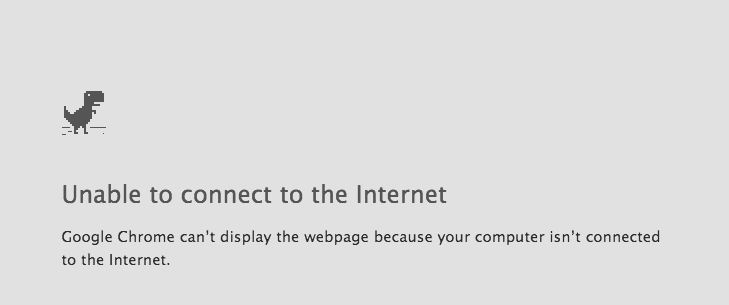

  

नमस्ते 🙏 • नमस्कार 🌸 • Hello 👋 • Bonjour ✨ • Hola 🚀

# 

Welcome to my little corner of GitHub!
I'm an Electronics & Telecommunication Engineering graduate who enjoys learning, creating, and exploring new ideas. Beyond technology, I love music, travelling, and discovering experiences that inspire curiosity and creativity.
My fascination with communication systems sparked an interest in understanding how information moves across networks. That curiosity gradually led me into the world of software, where I'm now exploring backend development, databases, and scalable systems.
This profile is a collection of my projects, experiments, and learning journey as I continue growing as a developer one project, one challenge, and one lesson at a time.

🚀 Always learning. Always building.

 

  

## 🌱 Currently Learning

- Python
- SQL
- Backend Development
- Data Structures & Algorithms

  

## 📡 From Signals to Software

My journey started with understanding how signals travel.
Today I'm learning how software receives, processes, stores, and delivers information at scale.
From networks and databases to backend systems, I enjoy building solutions that turn curiosity into working software.

 

<b>🛠️ My Tech Stack</b>

 

  

## 💭 How I work

My engineering background taught me to look at systems as connected pieces rather than isolated problems. I naturally gravitate toward understanding how things communicate, how information flows, and how small components come together to create something meaningful. 📡➡️💻
And if I ever seem too deep in thought, a well-timed joke is always welcome. 😄

  

 

## Building software from the city that never sleeps

  

